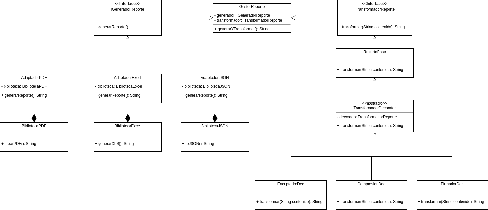

# Trabajo 2 – Patrones y Diseño de Software

## Objetivo
Demostrar la aplicación de principios **SOLID** y patrones estructurales.

---

## Parte A: Definición del Problema (33%)

1. Definir **dos problemas** donde se puedan implementar **patrones estructurales distintos**, justificando por qué la aplicación del patrón da solución al problema planteado.

  - Los problemas pueden estar relacionados o ser independientes entre sí.
  - La temática es libre.

## Solución Parte A

#### Definición del Problema

Un banco necesita generar reportes financieros en diversos formatos (PDF, Excel, JSON) que serán enviados a distintos departamentos y entes reguladores externos. Para generar estos archivos, se utilizan diferentes librerías externas, como iText para PDF, Apache POI para Excel y Jackson para JSON, todas con interfaces incompatibles.

Además, los reportes pueden necesitar transformaciones adicionales como encriptación, compresión, firma digital o agregación de metadatos según el destino y nivel de confidencialidad.

#### Solución Propuesta

Para este problema se plantea usar los patrones estructurales **Adapter** y **Decorator**.

**Patrón Adapter**:
- Integrar librerías externas con interfaces diferentes a través de una interfaz uniforme (`ReportGenerator`).
- Ocultar la complejidad de cada librería para que el sistema trabaje siempre con la misma interfaz.
- Agregar nuevos formatos de manera sencilla, creando nuevos adaptadores.

**Patrón Decorator**:
- Añadir funcionalidades extra de forma dinámica sin modificar el código original.
- Combinar transformaciones (encriptar + firmar + comprimir) en cualquier orden.
- Aplicar el principio de responsabilidad única, teniendo una clase por transformación.
- Seguir el principio abierto/cerrado, ya que no se necesita modificar las clases base para extender su funcionalidad.

---
---

## Parte B: Diagrama UML de Clases (33%)

1. Para cada uno de los problemas definidos en la Parte A, elaborar el **diagrama UML** donde se evidencie la estructura del patrón de diseño, explicando la correspondencia con los participantes.

  - Es importante que los nombres de las clases se adapten al dominio, es decir, no dejar nombres de clases genéricas o iguales a como se presentan en el material de estudio.
  - Se esperan **dos diagramas diferentes** o un único diagrama que implemente los dos patrones seleccionados.

## Solucion Parte B

#### Diagrama UML

### Participantes en el Diagrama

#### Patrón Adapter

- **IGeneradorReporte**: Interfaz que define el método `generarReporte()` utilizado por el cliente.
- **AdaptadorPDF, AdaptadorExcel, AdaptadorJSON**: Clases que implementan la interfaz `IGeneradorReporte` y adaptan las llamadas a los métodos específicos de cada biblioteca.
- **BibliotecaPDF, BibliotecaExcel, BibliotecaJSON**: Clases incompatibles originales que necesitan ser adaptadas para trabajar con el sistema.
- **GestorReporte**: Cliente que utiliza la interfaz `IGeneradorReporte` para generar reportes de manera uniforme.

#### Patrón Decorator

- **ITransformadorReporte**: Interfaz que define los métodos para los objetos que pueden tener responsabilidades añadidas.
- **ReporteBase**: Clase que implementa la funcionalidad básica para transformar reportes.
- **TransformadorDecorator**: Clase abstracta que mantiene una referencia al componente base y define una interfaz conforme a la interfaz del componente.
- **EncriptadorDec, CompresionDec, FirmadoDec**: Clases concretas que añaden funcionalidades específicas al componente base.

#### Integración de Patrones

- **GestorReporte**: 
  - Actúa como cliente y punto de integración de ambos patrones.
  - Contiene referencias a un generador (patrón Adapter) y un transformador (patrón Decorator).
  - A través del método `generarYTransformar()`, coordina la generación del reporte usando el adaptador adecuado y aplica las transformaciones necesarias mediante decoradores.
---

## Parte C: Implementación de los Patrones de Diseño (34%)

1. Implementar en el lenguaje de su elección las clases y los objetos que hacen parte de los **dos patrones estructurales**, evidenciando un correcto uso de estos y siguiendo principios **SOLID**.

  - No es necesario implementar funcionalidades completas.
  - Es suficiente con mostrar mensajes por consola donde se evidencie el funcionamiento del patrón.

